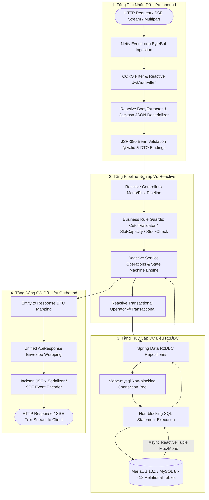
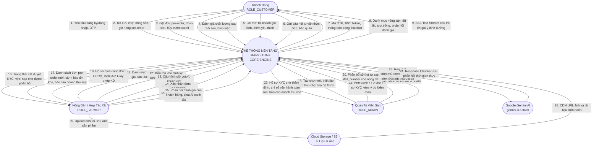
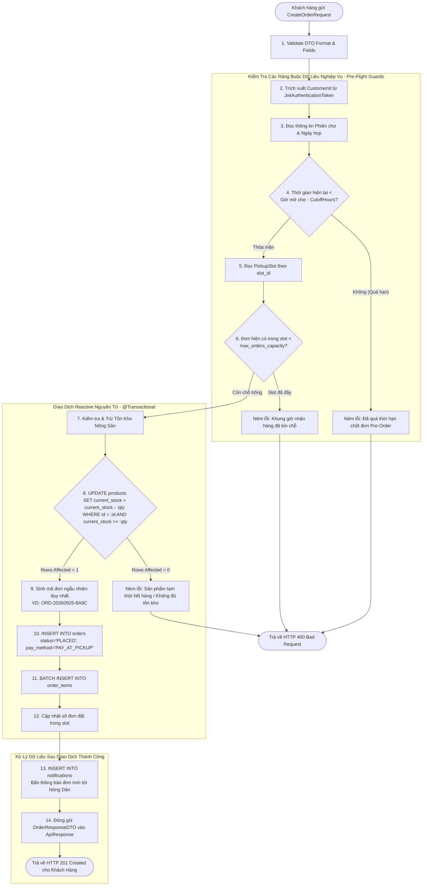
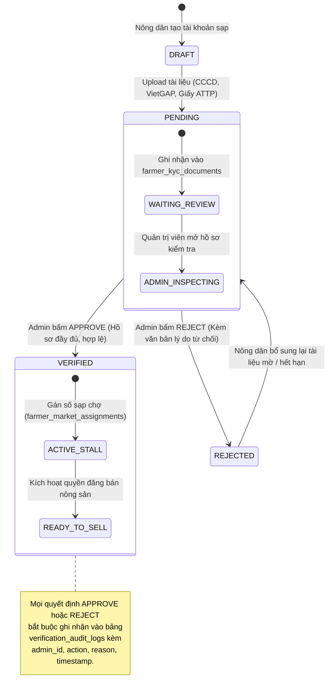

# TÀI LIỆU ĐẶC TẢ KIẾN TRÚC & LUỒNG XỬ LÝ DỮ LIỆU TOÀN DIỆN (DATA PROCESSING FLOW)
> **Hệ Thống MarketLink - Nền Tảng Thương Mại Điện Tử Nông Sản Sạch & Kết Nối Phiên Chợ Tương Tác**  
> **Dự án tham dự:** Techwiz 7 • **Đơn vị phát triển:** Gravity Team  
> **Kiến trúc:** Reactive Non-blocking (Spring Boot 3.4 WebFlux + R2DBC + Netty + React 19)

---

## 1. NGUYÊN LÝ & MÔ HÌNH XỬ LÝ DỮ LIỆU TỔNG THỂ

Hệ thống **MarketLink** vận hành trên nền tảng **Reactive Streams Architecture** (chuẩn phi khối Non-blocking I/O). Khác biệt hoàn toàn với mô hình truyền thống (Thread-per-Request bị nghẽn I/O khi chờ Database hoặc Third-party API), mô hình xử lý dữ liệu của MarketLink tối ưu hóa luồng chu chuyển thông qua cơ chế **Event-Driven Non-blocking Pipeline**.

### 1.1. Chuỗi chu chuyển dữ liệu End-to-End (Data Pipeline Lifecycle)



### 1.2. Các giai đoạn biến đổi dữ liệu (Data Transformation Stages)

| Giai đoạn | Dữ liệu đầu vào | Thành phần xử lý | Dữ liệu đầu ra | Đặc tính kỹ thuật |
| :--- | :--- | :--- | :--- | :--- |
| **Giai đoạn 1: Ingestion & Auth** | Raw HTTP Request / Bearer Token | `Netty EventLoop`, `JwtAuthenticationFilter` | `ServerWebExchange` + `AuthenticationToken` | Non-blocking, Stateless, giải mã HMAC-SHA256 trong 1-2ms |
| **Giai đoạn 2: Bind & Validate** | JSON Payload / Query Params | Jackson Decoder, JSR-380 Validator | Strongly-typed DTO (VD: `CreateOrderRequest`) | Trả về mã lỗi 400 kèm `fieldErrors` chi tiết nếu sai format |
| **Giai đoạn 3: Domain Rules** | Request DTO + User Identity | Service Layer, Domain Guard Validators | Validated Business Context | Kiểm tra hạn chốt đơn (`Cutoff`), dung lượng sạp (`Capacity`), tồn kho |
| **Giai đoạn 4: Atomic Mutation** | Domain State, Atomic Queries | R2DBC DatabaseClient, MariaDB Driver | Updated Rows / Created IDs | Transaction phi khối, câu lệnh điều kiện chống Overselling |
| **Giai đoạn 5: Serialization** | Reactive Entity / Model | Custom DTO Assembler, Jackson | `ApiResponse<T>` / SSE `data: {}` | Chuẩn hóa Envelope JSON, hỗ trợ Streaming text liên tục |

---

## 2. HỆ THỐNG SƠ ĐỒ LUỒNG DỮ LIỆU (DATA FLOW DIAGRAMS - DFD)

---

### 2.1. DFD Cấp 0 (Context Diagram - Sơ đồ ngữ cảnh dữ liệu)

Sơ đồ thể hiện luồng dữ liệu trao đổi giữa Hệ thống MarketLink với tất cả các tác nhân ngoại vi (External Entities).



---

### 2.2. DFD Cấp 1 (Sơ đồ phân rã tiến trình dữ liệu hệ thống)

Phân rã thành 8 tiến trình xử lý dữ liệu chính tương tác với 18 kho dữ liệu (Data Stores):

```mermaid
flowchart TB
    %% External Entities
    Cust([Khách hàng])
    Farm([Nông dân])
    Adm([Quản trị viên])
    AiExt([Gemini AI])

    %% Data Stores
    D1[(D1: users & roles)]
    D2[(D2: user_verifications)]
    D3[(D3: farmer_kyc_documents & audit_logs)]
    D4[(D4: farmer_profiles & customer_profiles)]
    D5[(D5: markets & market_schedules)]
    D6[(D6: farmer_market_assignments)]
    D7[(D7: categories & products)]
    D8[(D8: weekly_stock_templates)]
    D9[(D9: pickup_time_slots & cutoff_settings)]
    D10[(D10: orders & order_items)]
    D11[(D11: reviews)]
    D12[(D12: family_accounts & favorites)]
    D13[(D13: notifications & announcements)]

    %% Processes
    P1[1.0 Tiến trình Xác Thực & Quản Lý Danh Tính]
    P2[2.0 Tiến trình Thẩm Định KYC & Phân Sạp Chợ]
    P3[3.0 Tiến trình Quản Lý Danh Mục, Sản Phẩm & Tồn Kho]
    P4[4.0 Tiến trình Cấu Hình Phiên Chợ, Lịch Họp & Slot Nhận]
    P5[5.0 Tiến trình Xử Lý Vòng Đời Đặt Hàng Pre-Order]
    P6[6.0 Tiến trình Đánh Giá Chất Lượng & Phản Hồi Sạp]
    P7[7.0 Tiến trình Tài Khoản Nhóm & Tương Tác Yêu Thích]
    P8[8.0 Tiến trình Trợ Lý Trí Tuệ Nhân Tạo Gemini AI]
    P9[9.0 Tiến trình Tổng Hợp Dữ Liệu & Báo Cáo Dashboard]

    %% Data Flows
    Cust & Farm -->|Thông tin đăng ký, credentials| P1
    P1 <-->|Tra cứu/lưu User, Hash BCrypt, cấp OTP| D1 & D2
    P1 -->|JWT Claims, User Profile| D4

    Farm -->|CCCD, VietGAP, GPKD| P2
    P2 -->|Lưu tài liệu thẩm định| D3
    Adm -->|Quyết định Duyệt/Từ chối, Biên bản kiểm toán| P2
    P2 <-->|Cập nhật kyc_status, ghi audit log| D1 & D3
    P2 -->|Gán số sạp chợ| D6

    Farm -->|Thông tin nông sản, định mức tuần| P3
    P3 <-->|CRUD sản phẩm, nạp định mức kho| D7 & D8

    Adm -->|Tọa độ GPS, lịch mở chợ| P4
    Farm -->|Cấu hình cutoff, tạo slot nhận| P4
    P4 <-->|Lưu chợ, lịch họp, slot capacity| D5 & D9

    Cust -->|Đặt đơn pre-order, chọn slot, hủy đơn| P5
    Farm -->|Chuyển trạng thái: ACCEPTED, READY, COMPLETED| P5
    P5 <-->|Kiểm tra & trừ tồn kho Atomic, khóa slot| D7 & D9
    P5 <-->|Tạo/Cập nhật đơn hàng và chi tiết| D10
    P5 -->|Kích hoạt thông báo đẩy đơn hàng| D13

    Cust -->|Chấm điểm sao, viết review| P6
    Farm -->|Gửi phản hồi sạp chợ| P6
    P6 <-->|Đối soát trạng thái COMPLETED, ghi nhận review| D10 & D11

    Cust -->|Mời thành viên gia đình, theo dõi sạp| P7
    P7 <-->|Liên kết nhóm, lưu danh sách theo dõi| D4 & D12

    Cust & Farm -->|Câu hỏi tư vấn nông sản, thực đơn| P8
    P8 <-->|Streaming SSE Chunks| AiExt

    Adm -->|Yêu cầu số liệu vận hành, doanh thu chợ| P9
    P9 <-->|Aggregations & Group By Analytics| D1 & D5 & D7 & D10
```



---

## 3. CHI TIẾT CÁC LUỒNG XỬ LÝ DỮ LIỆU NÒNG CỐT (DETAILED DATA FLOWS)

---

### 3.1. Luồng Dữ Liệu Đặt Hàng Pre-Order & Điều Tiết Kho (DFD Cấp 2 - Tiến Trình 5.0)

Đây là **trái tim dữ liệu** của toàn bộ nền tảng MarketLink, đảm bảo không xảy ra hiện tượng **bán vượt tồn kho (Overselling)** và **quá tải khung giờ (Slot Congestion)**.



#### Thuật toán trừ tồn kho an toàn tuyệt đối (Atomic Conditional Mutation):
Để loại bỏ triệt để hiện tượng tranh chấp dữ liệu (Race Condition) khi hàng trăm khách hàng cùng bấm đặt một loại rau củ tại cùng một giây, hệ thống không dùng cơ chế "Read-then-Update" (dễ bị race) mà thực hiện **câu lệnh điều kiện nguyên tử** trực tiếp tại tầng CSDL:
```sql
UPDATE products 
SET current_stock = current_stock - :requestedQuantity,
    updated_at = NOW()
WHERE id = :productId 
  AND current_stock >= :requestedQuantity;
```
- Nếu `rows_affected == 1`: Trừ kho thành công, tiếp tục pipeline.
- Nếu `rows_affected == 0`: Tức là số lượng tồn kho thực tế tại mili-giây đó đã nhỏ hơn lượng đặt. Pipeline lập tức phát ra `Mono.error(new InsufficientStockException(...))` kích hoạt rollback toàn bộ giao dịch.

---

### 3.2. Luồng Dữ Liệu Bù Trừ / Hoàn Kho Tự Động (Compensating Data Flow - Rollback)

Khi một đơn hàng bị hủy bởi khách hàng hoặc bị từ chối bởi nông dân, luồng dữ liệu bù trừ (Compensating Transaction) được kích hoạt để đưa trạng thái hệ thống về điểm cân bằng:

```mermaid
sequenceDiagram
    autonumber
    actor Actor as Khách Hàng / Nông Dân
    participant Ctrl as OrderController
    participant Svc as OrderService
    participant R2dbc as R2DBC DatabaseClient
    participant DB as MariaDB

    Actor->>Ctrl: PUT /api/customer/orders/{id}/cancel HOẶC status='DECLINED'
    Ctrl->>Svc: cancelOrDeclineOrder(orderId, actorId)
    
    Svc->>DB: SELECT * FROM orders WHERE id = :id FOR UPDATE
    DB-->>Svc: Trả về trạng thái hiện tại (order_status)

    alt Đơn hàng không ở trạng thái PLACED hoặc ACCEPTED
        Svc-->>Actor: Ném lỗi: Đơn hàng ở trạng thái hiện tại không thể hủy
    else Khách hủy nhưng đã quá giờ Cutoff Time
        Svc-->>Actor: Ném lỗi: Đã quá hạn chốt đơn, không thể tự hủy
    else Điều kiện hủy/từ chối hợp lệ
        Note over Svc, DB: Bắt đầu Reactive Transaction bù trừ dữ liệu
        Svc->>DB: UPDATE orders SET order_status = 'CANCELLED' (hoặc 'DECLINED')
        
        loop Duyệt từng order_item trong đơn hàng
            Svc->>R2dbc: Hoàn lại tồn kho cho từng sản phẩm
            R2dbc->>DB: UPDATE products SET current_stock = current_stock + :itemQty WHERE id = :productId
        end

        Svc->>DB: Giảm số đơn hiện có trong pickup_time_slots
        Svc->>DB: INSERT INTO notifications (Thông báo lý do hủy đơn)
        Note over Svc, DB: Commit Reactive Transaction
        Svc-->>Actor: Trả về ApiResponse: Hủy đơn & hoàn kho thành công
    end
```

---

### 3.3. Luồng Dữ Liệu Thời Gian Thực Gemini AI (DFD Cấp 2 - Tiến Trình 7.0 & SSE Stream)

Luồng dữ liệu xử lý tin nhắn tương tác người dùng với Trợ lý AI nông nghiệp & thực đơn sử dụng kiến trúc **Server-Sent Events (SSE)** kết hợp `Flux<ServerSentEvent<AiChatResponse>>`:

```mermaid
flowchart TD
    UserReq([Khách hàng / Nông dân nhập Prompt]) --> NettySSE[GET /api/ai/chat/stream?prompt=...]
    NettySSE --> AiCtrl[AiAssistantController.streamChatWithAi]
    
    subgraph PromptEnrichment [Giai Đoạn Làm Giàu Dữ Liệu - Context Enrichment]
        AiCtrl --> SysContext[Inject System Instruction chuyên sâu:<br/>- Chuyên gia Nông Nghiệp & Nông Sản MarketLink<br/>- Tư vấn món ăn theo mùa vụ<br/>- Tư vấn bảo quản rau củ tươi sạch<br/>- Hướng dẫn canh tác hữu cơ VietGAP]
        SysContext --> BuildGeminiReq[Đóng gói Gemini Request Body JSON]
    end

    subgraph ReactiveWebClient [Giai Đoạn Trao Đổi Bất Đồng Bộ Với Google AI]
        BuildGeminiReq --> WebClientExec[Spring Reactive WebClient.post]
        WebClientExec --> GeminiEndpoint[Google Generative Language API<br/>models/gemini-3.6-flash:streamGenerateContent]
        GeminiEndpoint -.->|HTTP Chunk 1| ParseChunk1[Decode JSON Stream Chunk 1]
        GeminiEndpoint -.->|HTTP Chunk 2| ParseChunk2[Decode JSON Stream Chunk 2]
        GeminiEndpoint -.->|HTTP Chunk N| ParseChunkN[Decode JSON Stream Chunk N]
    end

    subgraph SSEStreamingPipeline [Giai Đoạn Đóng Khung Dữ Liệu SSE - Reactive Flux]
        ParseChunk1 --> MapSSE1[Format: ServerSentEvent.builder.data]
        ParseChunk2 --> MapSSE2[Format: ServerSentEvent.builder.data]
        ParseChunkN --> MapSSEN[Format: ServerSentEvent.builder.data]
        MapSSEN --> EmitDone[Emit event: [DONE]]
    end

    subgraph ClientRendering [Giai Đoạn Hiển Thị Dữ Liệu Phía Trình Duyệt]
        MapSSE1 --> EventSourceRx[Browser fetch stream reader / EventSource]
        MapSSE2 --> EventSourceRx
        MapSSEN --> EventSourceRx
        EmitDone --> EventSourceRx
        EventSourceRx --> TypingEffect[Render hiệu ứng gõ chữ thời gian thực]
    end
```

- **Cơ chế xử lý Backpressure:** Khi trình duyệt nhận gói tin chậm hơn tốc độ sinh của Gemini AI, bộ đệm (Buffer) của Spring WebFlux tự động điều tiết tốc độ phát (`Flux.onBackpressureBuffer`) tránh tràn RAM Netty Server.
- **Tính năng ngắt kết nối an toàn (Client Abort):** Khi người dùng nhấn nút "Dừng phản hồi" trên giao diện React, kết nối SSE bị đóng -> WebFlux lập tức hủy subscription (`doOnCancel`) tới Google AI, giúp tiết kiệm triệt để số lượng Token tiêu thụ.

---

### 3.4. Luồng Dữ Liệu Thẩm Định KYC Nông Dân & Kiểm Toán ( Tiến Trình 2.0)



---

## 4. MA TRẬN CHUYỂN DỊCH TRẠNG THÁI DỮ LIỆU & TÁC ĐỘNG BẢNG

Dưới đây là bảng tổng hợp chi tiết sự thay đổi dữ liệu trên toàn bộ 18 bảng CSDL qua từng sự kiện nghiệp vụ:

| Sự kiện (Event) | Trạng thái Đơn (`order_status`) | Bảng `orders` & `order_items` | Bảng `products` (`current_stock`) | Bảng `pickup_time_slots` | Bảng `notifications` |
| :--- | :--- | :--- | :--- | :--- | :--- |
| **Khách đặt trước (Place Order)** | `PLACED` | INSERT bản ghi đơn mới, mã đơn `ORD-...`, tổng tiền, thanh toán Pay-at-Pickup | **Giảm trừ ngay** số lượng đặt (`current_stock -= qty`) | **Tăng** số lượng đơn đặt trong khung giờ (`current_orders += 1`) | Bắn thông báo đơn mới tới sạp Nông dân |
| **Nông dân xác nhận (Accept)** | `ACCEPTED` | UPDATE `order_status = 'ACCEPTED'`, ghi nhận `updated_at` | Giữ nguyên trạng thái đã trừ | Giữ nguyên quota khung giờ | Bắn thông báo xác nhận tới Khách hàng |
| **Nông dân từ chối (Decline)** | `DECLINED` | UPDATE `order_status = 'DECLINED'`, ghi nhận lý do từ chối | **Hoàn trả kho ngay** (`current_stock += qty`) | **Giảm trừ** quota slot (`current_orders -= 1`) | Bắn thông báo giải thích lý do tới Khách hàng |
| **Khách tự hủy trước Cutoff** | `CANCELLED` | UPDATE `order_status = 'CANCELLED'`, kiểm tra điều kiện thời gian thực | **Hoàn trả kho ngay** (`current_stock += qty`) | **Giảm trừ** quota slot (`current_orders -= 1`) | Bắn thông báo khách hủy tới sạp Nông dân |
| **Đã soạn xong hàng (Ready)** | `READY_FOR_PICKUP` | UPDATE `order_status = 'READY_FOR_PICKUP'` | Giữ nguyên (Hàng đã đóng gói) | Giữ nguyên | Bắn thông báo nhắc khách đến sạp số X, chợ Y |
| **Khách nhận & thanh toán** | `COMPLETED` | UPDATE `order_status = 'COMPLETED'`, `payment_status = 'PAID'` | Giữ nguyên (Giao dịch hoàn tất) | Giữ nguyên | Gửi lời cảm ơn & mời khách hàng đánh giá sạp |

---

## 5. CHUẨN HÓA CẤU TRÚC GÓI TIN DỮ LIỆU (DATA CONTRACTS)

Mọi luồng dữ liệu trao đổi giữa Client và Server đều tuân thủ định dạng chuẩn quốc tế, giúp việc tích hợp giữa Frontend React và Backend WebFlux diễn ra đồng bộ, không bao giờ lệch kiểu dữ liệu (Zero Type Mismatch).

### 5.1. Định dạng phản hồi dữ liệu chuẩn (Standard Success Response)
```json
{
  "success": true,
  "message": "Đặt hàng trước nông sản thành công",
  "data": {
    "orderId": 482,
    "orderCode": "ORD-20260925-A7B2",
    "marketName": "Phiên Chợ Nông Sản Cầu Giấy",
    "stallNumber": "STALL-08",
    "farmerName": "Trang Trại Hữu Cơ Ba Vì",
    "pickupDate": "2026-09-27",
    "pickupSlotTime": "07:30 - 08:00",
    "totalAmount": 185000.00,
    "orderStatus": "PLACED",
    "paymentMethod": "PAY_AT_PICKUP",
    "items": [
      {
        "productId": 12,
        "productName": "Cải ngọt hữu cơ",
        "unit": "bó 500g",
        "unitPrice": 25000.00,
        "quantity": 3,
        "subtotal": 75000.00
      },
      {
        "productId": 18,
        "productName": "Cà chua bi Cherry VietGAP",
        "unit": "hộp 500g",
        "unitPrice": 55000.00,
        "quantity": 2,
        "subtotal": 110000.00
      }
    ],
    "createdAt": "2026-09-25T08:30:15"
  },
  "timestamp": "2026-09-25T08:30:15.124"
}
```

### 5.2. Định dạng dữ liệu lỗi chuẩn (Standard Error Envelope)
Khi luồng dữ liệu gặp ngoại lệ (Vi phạm cutoff, hết tồn kho, sai JWT), bộ lọc `GlobalExceptionHandler` trả về cấu trúc lỗi chi tiết:
```json
{
  "success": false,
  "message": "Không thể hoàn tất đơn đặt hàng: Số lượng tồn kho không đủ",
  "errorCode": "INSUFFICIENT_STOCK",
  "errors": [
    {
      "field": "items[0].quantity",
      "rejectedValue": 10,
      "message": "Sản phẩm 'Cải ngọt hữu cơ' chỉ còn 4 bó trong kho"
    }
  ],
  "timestamp": "2026-09-25T08:30:15.312"
}
```

### 5.3. Định dạng luồng dữ liệu thời gian thực (SSE Stream Data Frame)
```http
HTTP/1.1 200 OK
Content-Type: text/event-stream;charset=UTF-8
Transfer-Encoding: chunked
Connection: keep-alive
Cache-Control: no-cache

data: {"chunk": "Để ", "finished": false}

data: {"chunk": "bảo quản ", "finished": false}

data: {"chunk": "xà lách tươi ngon ", "finished": false}

data: {"chunk": "trong 1 tuần, bạn nên bọc giấy báo...", "finished": false}

data: {"chunk": "", "finished": true}

data: [DONE]
```

---

## 6. KẾT LUẬN & ĐIỂM SÁNG KIẾN VỀ XỬ LÝ DỮ LIỆU CỦA GRAVITY TEAM

1. **Hiệu năng vượt trội nhờ Reactive Streams:** Sử dụng 100% Non-blocking I/O từ Controller, Service cho đến Driver CSDL R2DBC, loại bỏ nghẽn tài nguyên và cho phép phục vụ hàng nghìn kết nối đồng thời với mức tiêu hao RAM cực thấp.
2. **Toàn vẹn dữ liệu đa tầng:** Cơ chế Atomic Conditional Mutation kết hợp Reactive Transaction `@Transactional` triệt tiêu lỗi bán vượt tồn kho (Overselling) trong các giờ cao điểm đặt hàng trước phiên chợ.
3. **Luồng dữ liệu thời gian thực tương tác cao:** Tích hợp trực tiếp Google Gemini 3.6 Flash qua Server-Sent Events, cung cấp phản hồi thông minh tức thì, tiết kiệm băng thông và tối ưu trải nghiệm người dùng.
4. **Kiểm toán dữ liệu minh bạch:** Mọi thay đổi về hồ sơ KYC của nông dân đều được lưu dấu vết (Audit Trail) đầy đủ, đảm bảo sự tin cậy tuyệt đối của nông sản cung ứng trên sàn.
